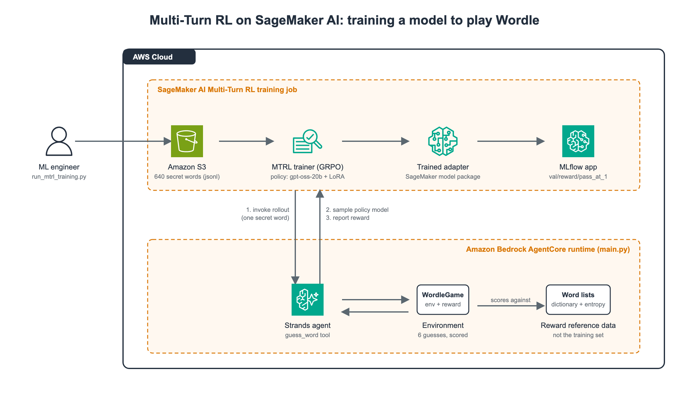
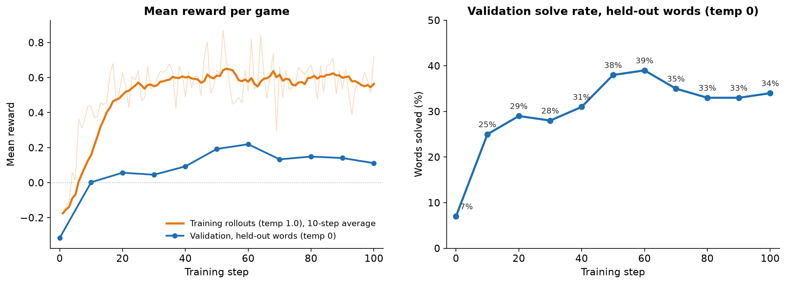

# Wordle-MTRL: Training a Language Model to Play Wordle with Multi-Turn Reinforcement Learning on Amazon SageMaker AI

[](LICENSE)

This project trains an open-weight language model (**gpt-oss-20b**) to play
Wordle using **SageMaker AI Multi-Turn Reinforcement Learning (MTRL)**. An
agent hosted on Amazon Bedrock AgentCore plays the game, the policy model
being trained makes the guesses, and the outcome of each game is the reward.
Training updates a LoRA adapter with GRPO. After 100 training steps, the model
solves **80%** of held-out words, up from 39% before training, which puts it
level with Claude Haiku 4.5 and gpt-oss-120b on this task.

Everything here has been run end to end, and every number below comes from a
real training or evaluation run. The goals are to show the complete MTRL
pipeline on a task everyone already understands, and to document the pitfalls
we hit so you can skip them.

This project is intended for demonstration purposes only. It is not intended
for use in a production environment.

## Table of Contents

- [Why Wordle? The Multi-Turn RL Challenge](#why-wordle-the-multi-turn-rl-challenge)
- [The Technology Stack: Why SageMaker AI and AgentCore?](#the-technology-stack-why-sagemaker-ai-and-agentcore)
- [Getting Started](#getting-started)
- [Usage](#usage)
  - [1. Test the environment locally](#1-test-the-environment-locally)
  - [2. Build the dataset](#2-build-the-dataset)
  - [3. Deploy the agent](#3-deploy-the-agent)
  - [4. Launch training](#4-launch-training)
  - [5. Evaluate the trained model at serving settings](#5-evaluate-the-trained-model-at-serving-settings)
  - [6. Baseline any Bedrock model](#6-baseline-any-bedrock-model)
  - [7. Clean up](#7-clean-up)
- [The Reinforcement Learning Strategy](#the-reinforcement-learning-strategy)
- [Results and Analysis](#results-and-analysis)
- [Lessons Learned](#lessons-learned)
- [Further Reading](#further-reading)
- [Attribution](#attribution)
- [License](#license)

---

## Why Wordle? The Multi-Turn RL Challenge

### What is Wordle?

Wordle is a word game with a hidden five-letter word and six guesses. After
each guess, every letter is marked green (right letter, right position),
yellow (in the word, wrong position), or gray (not in the word). The best way
to learn it is to play a round:
[Wordle on the New York Times](https://www.nytimes.com/games/wordle/index.html).

### Why multi-turn RL?

Wordle is a deliberately small task. Everyone already knows the rules, so you
can watch a model learn a multi-turn strategy without first learning a domain.
It is also genuinely multi-turn: each guess is constrained by the feedback from
the previous ones, and whether the game is won depends on decisions made
several turns earlier.

That is exactly the shape of problem MTRL is for. Supervised fine-tuning needs
a correct response to imitate, and a Wordle game has no single correct
sequence of guesses. Single-turn RL scores one response at a time, so it
cannot credit the opening guess that made a turn-3 solve possible. MTRL lets
the model play the whole game, scores the result, and learns from the spread
of results across several attempts at the same word.

Wordle is also a teaching vehicle, not a business case. It can be solved
algorithmically: an information-theoretic solver
([3Blue1Brown](https://www.youtube.com/watch?v=v68zYyaEmEA)) averages 3.42
guesses, and a frontier model solves 95% of games without any training. The
real value of MTRL is making a small, cost-effective model good at a
proprietary multi-step task that no frontier model has seen. Everything here
carries over to that setting unchanged.

### An example rollout

The model plays through a single tool, `guess_word`. After each guess the
environment returns per-letter feedback and a plain-English summary of
everything known so far. Below is one complete rollout of the **trained
model**, taken from the AgentCore runtime traces of an evaluation job (medium
reasoning effort, temperature 1.0). The secret word was FLARE. The model's
reasoning is shown as it was generated, lightly trimmed on the last turn.

```
[model] Reasoning: I must send the first guess immediately. The prompt instructs
        to choose a strong opener. Common words with distinct letters: "crane",
        "slate", "arise", "audio"? "slate" is good. I'll guess "slate".
        Tool call: guess_word(guess="slate")

[tool]  Guess 1/6: SLATE -> S=gray, L=green, A=green, T=gray, E=green
        Current Knowledge:
        - Correct Position (Green): _ L A _ E
        - In Word, Wrong Position (Yellow): None
        - Not in Word (Gray): S, T
        - Words Already Guessed: SLATE
        - Guesses Remaining: 5

[model] Reasoning: We have L A E at positions 2,3,5. So pattern _ L A _ E.
        Unknown letters for positions 1 and 4, not S or T. Use a word with new
        letters. "blaze"? B L A Z E fits: B in pos1, Z pos4. Both new letters.
        Tool call: guess_word(guess="blaze")

[tool]  Guess 2/6: BLAZE -> B=gray, L=green, A=green, Z=gray, E=green
        Current Knowledge:
        - Correct Position (Green): _ L A _ E
        - In Word, Wrong Position (Yellow): None
        - Not in Word (Gray): B, S, T, Z
        - Words Already Guessed: SLATE, BLAZE
        - Guesses Remaining: 4

[model] Reasoning: We know pattern _LA_E, letters outside: B,S,T,Z. We need new
        letters for positions 1 and 4. "flame" fits: F L A M E. That's 4 = M.
        F not in gray list. Good guess.
        Tool call: guess_word(guess="flame")

[tool]  Guess 3/6: FLAME -> F=green, L=green, A=green, M=gray, E=green
        Current Knowledge:
        - Correct Position (Green): F L A _ E
        - In Word, Wrong Position (Yellow): None
        - Not in Word (Gray): B, M, S, T, Z
        - Words Already Guessed: SLATE, BLAZE, FLAME
        - Guesses Remaining: 3

[model] Reasoning: We know pattern "FLA_E". Fourth letter unknown, M is not in
        the word. So we need a word F L A ? E. [...] "flare"
        Tool call: guess_word(guess="flare")

[tool]  Guess 4/6: FLARE — all green. Correct, you solved it!

[model] Word is FLARE.
```

A few things to notice. The model opens with a strong word, keeps every green
letter in place, never reuses a gray letter, and spends its unknown positions
on letters it has not tried. It also reasons briefly on the early turns and at
length only on the last one, when the candidate set is small. None of this
was in the training data. The dataset contains only secret words, and the
model learned the strategy from the reward.

When the game ends, the agent returns one number, the reward: **+1.292** for
this game. How that number is built is covered in
[The Reinforcement Learning Strategy](#the-reinforcement-learning-strategy).

---

## The Technology Stack: Why SageMaker AI and AgentCore?



The system has two halves that talk to each other during training.

**Amazon SageMaker AI Multi-Turn RL** owns the training job and the policy
model. It is serverless: you pick a base model, point the job at your agent
and dataset, and pay per token processed, with no GPU cluster to provision.
For every rollout the service invokes the agent with one training row. It
collects several rollouts of the same word, and **Group Relative Policy
Optimization (GRPO)** uses the spread of their rewards to update the model.
Metrics stream to an MLflow app.

**Amazon Bedrock AgentCore** hosts the agent. A single Python file,
`Wordle/app/Wordle/main.py`, holds the environment, the `guess_word` tool, and
the reward function, so there is no separate reward service. The agent is a
Strands agent that calls the policy model through the SageMaker Job Runtime's
OpenAI-compatible endpoint.

**LoRA (low-rank adaptation)** is how MTRL keeps training affordable. Rather
than updating all of the model's weights, LoRA freezes the base model and
trains two small matrices next to selected weight matrices; their product is a
low-rank update added to the frozen weights. In this run the service trained
rank-32 adapters (alpha 64) on gpt-oss-20b's attention projections and
mixture-of-experts layers. The adapter is 1.4 GB, against about 39 GB for the
full model, and the output model package contains both the adapter and a
merged checkpoint ready to deploy.

Supported base models at the time of writing (see the
[MTRL documentation](https://docs.aws.amazon.com/sagemaker/latest/dg/model-customize-mtrl.html)
for the current list):

| Base model | AWS Regions |
|---|---|
| Nova Lite 2.0 | us-east-1, us-west-2 |
| GPT-OSS-20B | us-east-1, us-west-2 |
| Gemma 4 31B (instruction-tuned) | us-west-2 |
| Qwen 3.6 27B | us-west-2 |

This project uses GPT-OSS-20B: it has the lowest per-token price of the four,
its reasoning effort is controllable per request, and the open weights make
the adapter easy to serve anywhere.

---

## Getting Started

### Prerequisites

- Python 3.10+, [`uv`](https://docs.astral.sh/uv/), Node 20+ (for the CDK),
  and the AgentCore CLI (`npm install -g @aws/agentcore`). See
  [Get started with Amazon Bedrock AgentCore](https://docs.aws.amazon.com/bedrock-agentcore/latest/devguide/agentcore-get-started-cli.html)
  for installation and the IAM permissions the CLI needs.
- `botocore >= 1.43.37` on the machine that launches the job (first version
  with the AgentRFT `CreateJob` operation).
- An S3 bucket and an MLflow app in the Region you deploy to.
- The two IAM roles described below.

Pinned versions this was validated with: `sagemaker-train 1.21.0`,
`sagemaker-core 2.21.0`, `bedrock-agentcore 1.22.0`, `strands-agents 1.54.0`.

### 1. Set up the environment

Clone the repository and install both Python environments: the root one for
the launcher and evaluation scripts, and the agent's own.

```bash
git clone https://github.com/aws-samples/sample-multi-turn-rl-wordle.git
cd sample-multi-turn-rl-wordle
uv sync
(cd Wordle/app/Wordle && uv sync)
```

### 2. Create the IAM roles

Two roles. Both trust policies matter, and one of them is not what the generic
SageMaker docs show.

**Agent runtime role** (created by `agentcore deploy`): trusts
`bedrock-agentcore.amazonaws.com`; needs `AmazonSageMakerJobRuntimeAccess`
(attached by the CDK stack in this repo).

**Training job role** (you create it): must trust
**`job.sagemaker.amazonaws.com`** with both `sts:AssumeRole` and
`sts:TagSession`. Plain `sagemaker.amazonaws.com` is not enough, and the error
message says so only after the third retry. Attach
`AmazonSageMakerJobFullAccess`, which covers S3, ECR, EC2 networking, MLflow,
model packages, and `bedrock-agentcore:InvokeAgentRuntime`.

Your caller needs `iam:PassRole` for `job.sagemaker.amazonaws.com` plus the
`sagemaker:*Job*` actions. Full reference:
[MTRL prerequisites](https://docs.aws.amazon.com/sagemaker/latest/dg/model-customize-mtrl-prereqs.html).

### Repository layout

```
.
├── Wordle/                         AgentCore project (agentcore-cli)
│   ├── agentcore/
│   │   ├── agentcore.json          runtime spec + env vars (REASONING_EFFORT, ...)
│   │   ├── aws-targets.json        account + region  <-- edit this
│   │   └── cdk/lib/cdk-stack.ts    attaches AmazonSageMakerJobRuntimeAccess
│   └── app/Wordle/
│       ├── main.py                 agent, environment, reward, RFT handler
│       ├── test_env.py             offline tests, no AWS needed
│       └── data/                   NYT word lists + entropy: reward reference data, not training data
├── docs/architecture.{html,png}    the diagram above (SVG source + render)
├── make_dataset.py                 builds training/validation JSONL
├── run_mtrl_training.py            launches / attaches to the MTRL job
├── run_mtrl_eval.py                SageMaker evaluation jobs: base vs trained at chosen temperature
├── eval_frontier.py                zero-shot baseline for any Bedrock model
├── training-data.jsonl             600 unique secret words
└── validation-data.jsonl           100 unique, disjoint from training
```

---

## Usage

### 1. Test the environment locally

No AWS account needed. This checks the game logic, the reward ordering, and
the dataset round-trip.

```bash
cd Wordle/app/Wordle
uv run python test_env.py
```

### 2. Build the dataset

```bash
uv run python make_dataset.py      # 600 train / 100 val, all unique, seed 42
```

This writes `training-data.jsonl` (600 rows) and `validation-data.jsonl` (100
rows, no overlap with training). Here are the first three training rows:

```jsonl
{"prompt": "{\"prompt\": \"Guess the 5-letter word\", \"answer\": \"carat\", \"id\": \"wordle_train_0000\"}"}
{"prompt": "{\"prompt\": \"Guess the 5-letter word\", \"answer\": \"valet\", \"id\": \"wordle_train_0001\"}"}
{"prompt": "{\"prompt\": \"Guess the 5-letter word\", \"answer\": \"botch\", \"id\": \"wordle_train_0002\"}"}
```

Each row has one column, `prompt`, and its value is a string. The MTRL
service reads that column and passes the string to the agent verbatim; it
does not parse or validate it. So the row packs everything the agent needs
into a small JSON object, which `parse_task()` in `main.py` unpacks:

```json
{
  "prompt": "Guess the 5-letter word",
  "answer": "carat",
  "id": "wordle_train_0000"
}
```

- `prompt` is the instruction shown to the policy model. It is identical on
  every row, because every game starts the same way.
- `answer` is the secret word. It stays inside the environment: the model
  never sees it, only the feedback the environment computes from it.
- `id` identifies the row in logs.

That is the whole dataset. There are no example games, no target responses,
and no labels in the usual sense. The service also accepts Parquet, JSON, and
CSV, and for tasks that need more context a row can carry a full message
list, tool configuration, or reward specification in the same string. See
[Prompt dataset format](https://docs.aws.amazon.com/sagemaker/latest/dg/model-customize-mtrl-assets.html)
in the SageMaker AI documentation.

### 3. Deploy the agent

Edit `Wordle/agentcore/aws-targets.json`: replace the placeholder account ID
with yours, and pick the Region. The training job must run in the **same
Region** as the runtime, or `CreateJob` rejects it.

If you plan to contribute back, keep your account ID out of commits with
`git update-index --skip-worktree Wordle/agentcore/aws-targets.json` after
editing it. Then:

```bash
cd Wordle
agentcore validate
agentcore deploy
```

Note the runtime ARN from the output. The CDK stack attaches the
`AmazonSageMakerJobRuntimeAccess` managed policy to the runtime role; without
it every rollout fails with `AccessDenied` when the agent calls the policy
model. Use the CLI rather than hand-building a code package: the runtime runs
Linux ARM64, and the agent's compiled dependencies (numpy, pandas, pyarrow,
through MLflow) must be resolved for that platform.

Smoke-test with an RFT-shaped payload. A fake `jobArn` is expected to 400,
which proves the whole chain works: payload parsing, bearer-token auth, and
error reporting.

```bash
aws bedrock-agentcore invoke-agent-runtime \
  --agent-runtime-arn <RUNTIME_ARN> \
  --runtime-session-id smoke-test-$(date +%s)000000000000000 \
  --payload fileb://payload.json /dev/stdout
```

Run this from `Wordle/`. [`payload.json`](Wordle/payload.json) holds one task
row in the `prompt` field and a fake `jobArn` in `metadata`.

### 4. Launch training

```bash
uv run python run_mtrl_training.py \
  --model openai-reasoning-gpt-oss-20b \
  --agent-runtime-arn <RUNTIME_ARN> \
  --role-arn arn:aws:iam::<ACCOUNT>:role/<JOB_ROLE> \
  --s3-prefix s3://<BUCKET>/wordle-mtrl \
  --s3-output-path s3://<BUCKET>/wordle-mtrl/output/ \
  --val-dataset s3://<BUCKET>/wordle-mtrl/validation/validation-data.jsonl \
  --mlflow-app-arn arn:aws:sagemaker:<REGION>:<ACCOUNT>:mlflow-app/<APP_ID> \
  --max-steps 100 --max-epochs 6
```

`--s3-prefix` uploads `training-data.jsonl` for you; pass `--train-dataset`
instead to reuse an existing S3 object. `MlflowConfig` is **required** by
`CreateJob`, so create an MLflow app first
(`aws sagemaker create-mlflow-app ...`) if you don't have one. The 100-step
run in this repository took about 4 hours 18 minutes.

Reattach to a running job at any time:

```bash
uv run python run_mtrl_training.py --attach <JOB_NAME> --role-arn ... --s3-output-path ...
```

### 5. Evaluate the trained model at serving settings

The training job's validation curve is scored at temperature 0 and the
deployed reasoning effort. To score the model package (and the base model) at
the settings you will actually serve, launch SageMaker evaluation jobs against
the same runtime and reward:

```bash
uv run python run_mtrl_eval.py --runs base:1.0 trained:1.0 \
  --model-package-arn <OUTPUT_MODEL_PACKAGE_ARN> \
  --agent-runtime-arn <RUNTIME_ARN> \
  --role-arn arn:aws:iam::<ACCOUNT>:role/<JOB_ROLE> \
  --dataset s3://<BUCKET>/wordle-mtrl/validation/validation-data.jsonl \
  --s3-output-path s3://<BUCKET>/wordle-mtrl/eval/ \
  --mlflow-app-arn arn:aws:sagemaker:<REGION>:<ACCOUNT>:mlflow-app/<APP_ID>
```

Each run is 100 rollouts and takes about seven minutes; metrics land in MLflow
under `eval/reward/*`. Only one evaluation job runs at a time per account, so
the script runs `--runs` sequentially. Reasoning effort is not a job
parameter: change `REASONING_EFFORT` in `agentcore.json`, `agentcore deploy`,
evaluate, then deploy the training value back. Never redeploy while a training
or evaluation job is running.

The `HyperParameters` the API accepts are flat strings named
`eval_group_size`, `temperature`, `sampling_top_p`, `sampling_max_tokens`,
`pass_k_values`, `success_threshold`, `rollout_timeout`,
`rollout_max_concurrency`, `rollout_max_retries`. The nested form in the docs
and the `sampling_temperature` / `top_p` / `max_tokens` names the SDK's
`MultiTurnRLEvaluator` emits are both rejected by schema validation; the error
message lists the accepted names.

### 6. Baseline any Bedrock model

```bash
uv run python eval_frontier.py --model global.anthropic.claude-opus-5 --n 100
```

Runs the same environment and reward against a Bedrock model. The harness
sends no reasoning or thinking parameters, so each model runs at its Bedrock
default: adaptive thinking at high effort for Claude Opus 5, thinking off for
Claude Haiku 4.5, medium effort for gpt-oss. Record that alongside the number.

By default this uses the Converse API. Some models only support tool calling
through Bedrock Mantle, and Claude models on Mantle expose the Anthropic
Messages API rather than Chat Completions, so pick the path per model:

```bash
uv run python eval_frontier.py --model google.gemma-3-27b-it --mantle            # Chat Completions
uv run python eval_frontier.py --model anthropic.claude-opus-5 --mantle messages  # Anthropic Messages
```

Check the model's Bedrock model card for which endpoint and API carry
client-side tool calling.

### 7. Clean up

Training and evaluation jobs stop billing when they complete, but the
AgentCore runtime, its IAM role, the MLflow app, and the S3 objects persist.

```bash
# 1. Agent runtime and its execution role. `remove all` resets the project
#    config; the next deploy sees the empty state and tears down the resources.
cd Wordle
agentcore remove all
agentcore deploy

# 2. MLflow app
aws sagemaker delete-mlflow-app --arn arn:aws:sagemaker:<REGION>:<ACCOUNT>:mlflow-app/<APP_ID>

# 3. Datasets, job output, and evaluation output
aws s3 rm s3://<BUCKET>/wordle-mtrl/ --recursive
```

`remove all` rewrites the files under `Wordle/agentcore/`, so run
`git checkout -- Wordle/agentcore/` afterward if you want to redeploy later.
Deleting the CloudFormation stack directly
(`aws cloudformation delete-stack --stack-name AgentCore-Wordle-default`)
removes the same resources without touching the project files. The training
job role and the model packages in the output model package group are not
billed, so you can keep them for a future run.

---

## The Reinforcement Learning Strategy

The reward function is where multi-turn RL succeeds or fails. Each rollout
returns a single number built from two parts: a dominant **outcome** term that
depends only on how the game ended, and a small bounded **shaping** term that
rewards good Wordle play within each outcome.

```
reward = outcome + 0.15 * clip(shaping, -1, 1)
```

### 1. The outcome

| Outcome | Value |
|---|---:|
| Solved on guess *n* | `1.0 + 0.5 * (6-n)/5` → 1.5 on guess 1, 1.0 on guess 6 |
| Played all six, unsolved | −0.5 |
| Never made a valid guess | −1.5 |

Every solve beats every loss, faster solves beat slower ones, and never playing
is strictly the worst result. `test_env.py` asserts this ordering, so an edit
cannot silently break it.

### 2. Shaping: penalties for rule violations and mistakes (the "stick")

The shaping score is a running total over the game, using the per-guess
scoring from [wordle-lora-rl](https://github.com/charbull/wordle-lora-rl). The
environment tracks every known green, yellow, and gray letter and penalizes
guesses that ignore them:

- **Green violation (`green_position_penalty`, −30):** not placing a known green letter in its spot.
- **Yellow violation (`yellow_letter_penalty`, −20):** leaving out a known yellow letter.
- **Gray violation (`gray_letter_penalty`, −20):** using a letter already marked gray.
- **Repeated guess (`repetition_penalty`, −40):** guessing a word already played. It still uses up a guess.
- **Not a word (`not_in_dictionary_penalty`, −35):** five letters, but not in the Wordle dictionary.
- **Malformed input (−50):** not five letters. It does not use up a guess.
- **Raw-text tool call (`text_format_penalty`, −5):** a guess recovered from a tool call the model wrote as plain text instead of a structured call (see [Lesson 3](#lesson-3-rl-can-erode-tool-calling-format)).

### 3. Shaping: bonuses for strategic play (the "carrot")

- **Valid guess (`valid_guess_base`, +15):** for each valid guess that doesn't solve the game.
- **Opening word (`information_gain_bonus_coeff`, 7.5 × entropy):** on turn 1 only, a bonus proportional to the word's pre-computed information gain, so strong openers like SOARE or SLATE score well.
- **New letters (`new_letter_bonus`, +2 each):** from turn 2 on, for each letter not yet tried.
- **Possibility reduction (`possibility_reduction_bonus`, up to +15):** from turn 2 on, proportional to the fraction of remaining candidate answers the guess eliminates.

### 4. Penalties for inefficiency

- **Time (`time_penalty_per_guess`, −1):** every guess.
- **Stagnation (`green_reuse_penalty` −3, `yellow_reuse_penalty` −1.5):** for reusing already-known letters instead of testing new ones.

### 5. How the pieces combine

The shaping total is divided by 150, clipped to ±1, and weighted by 0.15, so it
can move a reward by at most 0.15 in either direction. That is enough to
separate two games with the same outcome, but nowhere near the 1.5 gap between
the slowest solve and a loss.

Take the FLARE rollout above. Solving on guess 4 gives an outcome of 1.2, and
the shaping total of +91.9 (a strong opener, new letters on every turn, no
violations) adds 0.092, for **+1.292**. Had the model wasted a guess on STALE
before FLARE, which repeats two gray letters and misplaces three greens, the
same word would have scored **+1.100**: the outcome drops to 1.1 for a
five-guess solve, and the violation penalties cancel the shaping entirely.
Both games won, but one was played better, and GRPO needs exactly that kind
of difference between rollouts to compute a gradient. The constants live at
the top of `Wordle/app/Wordle/main.py`.

### Hyperparameters

Set in `run_mtrl_training.py`. The ones that mattered:

| Parameter | Value | Why |
|---|---|---|
| `learning_rate` | **1e-5** | The documented default for both supported models. |
| `sampling_max_tokens` | 8192 | The service cap. 4096 truncated gpt-oss mid-reasoning before its first tool call. |
| `temperature` | 1.0 | 1.2 was tried to diversify openers; it wasn't needed and hotter sampling helps a policy wander off its tool-call template. |
| `group_size` | 4 | GRPO group. Reward stdev within groups was reported as 0 at points, so 8–16 is the next thing to try. |
| `global_batch_size` | 32 | 600 prompts → 19 steps/epoch, so 100 steps needs `max_epochs >= 6`. |

`REASONING_EFFORT=low` is set as a runtime env var in `agentcore.json`, and
gpt-oss honors it as a request parameter. `REASONING_PROMPT_HINT`
additionally prepends `Reasoning: low` to the system prompt, which is the
Harmony convention gpt-oss expects; leave it off for models that don't use
the Harmony format. Low
effort cut sample tokens by about 80% during training. The adapter it produced
transfers to medium effort at serving time (60% → 80%, see
[Results and Analysis](#results-and-analysis)), so training at low and serving
at the model's default is a reasonable trade; training at medium is untested
here and would cost roughly 3x the sample tokens (mean response 804 vs 280
tokens in the evaluation jobs).

---

## Results and Analysis

Training ran for 100 steps on 600 words and was scored on 100 held-out words
the model never saw in training.

### Training performance

The training service logs metrics to MLflow as it trains. Two tell the story:



- **Mean reward per game (left).** Training rollouts (`rollout/reward/mean`)
  climb from −0.18 to about +0.6 within 30 steps and hold there. Validation
  reward on held-out words (`val/reward/mean`) rises too, from −0.32 to
  between +0.1 and +0.2.
- **Validation solve rate (right).** The share of held-out words solved
  (`val/reward/pass_at_1`) goes from 7% to a peak of 39% at step 60, then
  settles at 34%.

The two sets of curves are sampled differently. Training rollouts use
temperature 1.0; the service scores validation at **temperature 0**, with the
effort the agent was deployed with (`low` here), and neither setting is
configurable. The validation curve is a faithful signal that training works
and shows the plateau around step 60, but it understates the adapter by a wide
margin, as the next section shows.

### Evaluation: trained vs. base model

We evaluated the base model and the trained model package with SageMaker
evaluation jobs, varying the two settings the curve holds fixed: **reasoning
effort** and **sampling temperature**. In each bar, the gray segment is the
base model and the blue segment is the gain from training, so the top of the
bar is the trained model.


The low-effort, temperature-0 pair is the training job's own validation at
steps 0 and 100. The trained model at medium effort and temperature 1.0 is the
average of two evaluation runs.

### Comparison with frontier models

Frontier models run zero-shot through the **identical** environment, prompt,
tool, and reward, each at its default reasoning setting:

| Model | Parameters | Solve rate | Mean reward | Trained on task? | Reasoning / decoding |
|---|---:|---:|---:|:---:|---|
| Optimal solver (information-theoretic) | — | 100% | +1.354 | — | — |
| Claude Opus 5 | undisclosed | 95% | +1.226 | no | adaptive thinking, high (default) |
| Claude Haiku 4.5 | undisclosed | 82% | +0.950 | no | thinking off (default) |
| gpt-oss-120b | 117B (5.1B active) | 81% | +0.981 | no | medium effort (default) |
| **gpt-oss-20b, after MTRL** | 21B (3.6B active) | **80%** | **+0.930** | **yes** | medium effort (default), temp 1.0 |
| DeepSeek v3.2 | 671B (37B active) | 58% | +0.537 | no | model default |
| **gpt-oss-20b, base** | 21B (3.6B active) | **39%** | **+0.237** | no | medium effort (default), temp 1.0 |
| Qwen3-32B | 32B | 15% | −0.282 | no | model default |

The two gpt-oss-20b rows come from `run_mtrl_eval.py` at the model's default
reasoning effort and the training temperature; the trained row averages two
evaluation runs. The other rows come from `eval_frontier.py` against Bedrock at
each model's defaults.

### Analysis and key findings

1. **Training more than doubled the solve rate.** At default settings the
   model went from 39% to 80%, level with Claude Haiku 4.5 and with its own
   117B sibling, gpt-oss-120b, at a mean reward within 0.02 of Haiku's.
2. **Greedy decoding hides the gains.** At temperature 0 the model tends to
   stop after two or three calls without finishing the game, at either effort,
   so both base and trained sit near the bottom of their range.
3. **Reasoning effort matters once sampling is on.** Medium effort adds 20 to
   25 points over low at temperature 1.0.
4. **The adapter transfers across settings.** It adds 20 to 46 points in every
   cell, including medium effort, which it was never trained at.
5. **Evaluate at the settings you will serve at.** Temperature 1.0 is also what
   training sampled at, so the trained model is in-distribution there. Had we
   trusted only the training curve, we would have reported 34%.

**Next steps to improve performance:** validation solve rate peaked around
step 60 and drifted down, so more steps alone won't help. The most promising
untried change is a curriculum that seeds games with 0–4 prior guesses, so the
policy learns deduction without first surviving the opening; wordle-lora-rl
reports this as its single biggest gain. Raising `group_size` is the other
obvious lever. Every training row has the identical prompt text and only the
hidden answer varies, so this dataset exercises "learn from interaction," not
"learn from your data."

---

## Lessons Learned

Things that cost real training runs to discover, in the order you'll hit them.

### Lesson 1: The plumbing fails before the learning does

Most of the early failures were integration bugs, not RL problems.

- **The `@sagemaker_rft_handler` decorator does not start an HTTP server.**
  The AWS docs template implies it does. Without `BedrockAgentCoreApp` and
  `@app.entrypoint` wrapping it, the runtime times out after 30 s on every
  invocation. Decorator order is `@app.entrypoint` outermost.
- **`generate_token()` builds a fresh botocore session per call.** Under 32
  concurrent rollouts that starves the container credential provider
  (`No AWS credentials found`). Caching the token for an hour then failed
  differently: it's signed with rotating instance credentials, so cached
  tokens go stale and 403 (`Authentication failed`). The fix is one shared
  botocore session whose credentials self-refresh, plus a short token cache
  and a re-sign on 403.
- **Never redeploy the agent while a job is running.** It restarts the
  runtime, in-flight rollouts see no sampling requests, and the service fails
  the whole job.
- **Always return a reward.** A rollout with zero guesses fails the entire job
  (`No sampling requests were received`), and so does returning
  `{"status": "error"}` (`The agent signaled that the trajectory failed`). The
  agent retries a zero-guess rollout once with a fresh conversation, bounded by
  a wall-clock budget so it can't outrun the reward-reporting window.

### Lesson 2: Summing per-guess rewards inverts the incentives

The first design summed wordle-lora-rl's per-guess scores into one reward per
game. That works in wordle-lora-rl, which scores each guess as an independent
training example, but over a whole game it paid +0.49 for a *lost* game and
scored a turn-1 solve *below* a turn-3 solve, because six turns of base and
exploration bonuses outweighed a −1/turn time penalty. Separating a dominant
outcome term from bounded shaping fixed both. If you change the reward, run
`test_env.py`; it asserts `fast win > slow win > loss > never played`.

### Lesson 3: RL can erode tool-calling format

RL can gradually push a model away from the structured tool calls its agent
framework knows how to execute. Instead of a real `guess_word` call, the model
starts writing the call out as plain text, for example
`<__function=guess_word>...` or `guess_word("crane")`. Once that happens,
nothing runs: every rollout in a group gets the same floor reward,
within-group variance drops to zero, and GRPO has no gradient left to pull the
model back. The drift can take over a run and never reverse.

It is more likely at higher learning rates, and some models are more prone to
it than others, so treat it as a risk to watch for rather than a rare bug.
Three defenses:

- **Start at a conservative learning rate.** This run used 1e-5. Raise it
  only with evidence that training is too slow.
- **Watch for it early.** Track how often guesses arrive as raw text rather
  than structured calls; the agent logs a warning for every rollout in which
  it had to recover them.
- **Keep a gradient alive.** `main.py` recovers guesses written as raw text
  (three observed formats) and scores them with a small formatting penalty,
  so rollouts still differ and GRPO can steer back toward proper calls. The
  same recovery turned out to matter at evaluation time, for models that write
  tool calls as prose.

### Lesson 4: Measure with the service's metrics, not log scraping

The service logs `val/reward/pass_at_1` on the held-out set with
`success_threshold = 1.0`, which for this reward function means "solved."
Scraping CloudWatch for "solved" strings over-reported the win rate by more
than 2x because it mixed training and validation rollouts and dropped rollouts
that ended in exceptions.

### Lesson 5: The validation curve is not the serving number

The training job scores validation at temperature 0 with the deployed
reasoning effort, and you cannot change either. For this task greedy decoding
makes the model quit early, so the curve topped out at 34% while the same
model package scores 80% at medium effort and temperature 1.0. Run
`run_mtrl_eval.py` at your serving settings before drawing conclusions, and use
the curve for what it is good at: showing whether training is still improving.

### Lesson 6: Training settings and serving settings are separate choices

Reasoning effort and temperature each show up twice in this pipeline: once
when training samples rollouts, and again when you evaluate or serve the
model. They don't have to match, and choosing them separately paid off here.

- **Train cheap, serve at the default.** Training at low reasoning effort cut
  sample tokens by about 80%. The resulting adapter scored 80% when served at
  medium effort, against 60% at low, and its gain over the base model held at
  both (+41 and +46 points).
- **Serve near the training temperature.** Training sampled at temperature
  1.0. At 1.0 the trained model solved 60 to 80% of words; at temperature 0 it
  fell to 33 to 34%, at either effort.
- **Know what you haven't tested.** This project changed these settings at
  evaluation time only. Whether training at medium effort or a different
  temperature would raise the ceiling is untested, and medium effort would
  cost roughly three times the sample tokens.

---

## Further Reading

- [Multi-turn reinforcement learning on Amazon SageMaker AI](https://docs.aws.amazon.com/sagemaker/latest/dg/model-customize-mtrl.html): concepts, supported models, and pricing dimensions
- [MTRL model evaluation](https://docs.aws.amazon.com/sagemaker/latest/dg/model-customize-mtrl-evaluation.html): evaluation jobs and their metrics
- [MTRL prerequisites](https://docs.aws.amazon.com/sagemaker/latest/dg/model-customize-mtrl-prereqs.html): IAM roles and permissions
- [Amazon SageMaker AI pricing](https://aws.amazon.com/sagemaker/ai/pricing/): per-token rates for prefill, sample, and train
- [Get started with Amazon Bedrock AgentCore](https://docs.aws.amazon.com/bedrock-agentcore/latest/devguide/agentcore-get-started-cli.html): the AgentCore CLI
- [wordle-lora-rl](https://github.com/charbull/wordle-lora-rl): the Wordle environment and reward this project builds on, trained locally with MLX
- [LoRA: Low-Rank Adaptation of Large Language Models](https://arxiv.org/abs/2106.09685) (Hu et al., 2021)
- [DeepSeekMath](https://arxiv.org/abs/2402.03300) (Shao et al., 2024), which introduced GRPO
- [Solving Wordle using information theory](https://www.youtube.com/watch?v=v68zYyaEmEA) (3Blue1Brown)

## Attribution

The environment design, reward constants, clue-state tracking, and word lists
are ported from [charbull/wordle-lora-rl](https://github.com/charbull/wordle-lora-rl)
(its README declares the MIT license), adapted from tag-parsing GRPO to a
tool-calling agent on AgentCore. The optimal-play statistics (3.42 mean
guesses) follow the information-theoretic approach popularized by
[3Blue1Brown](https://www.youtube.com/watch?v=v68zYyaEmEA).

## License

MIT-0 (MIT No Attribution). See [LICENSE](LICENSE).

Portions of the Wordle environment, reward, and word lists come from
[wordle-lora-rl](https://github.com/charbull/wordle-lora-rl) under the MIT
License. See [THIRD-PARTY-LICENSES](THIRD-PARTY-LICENSES).
